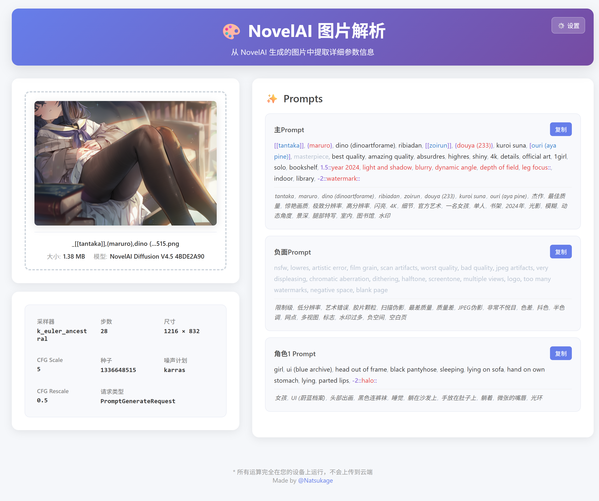
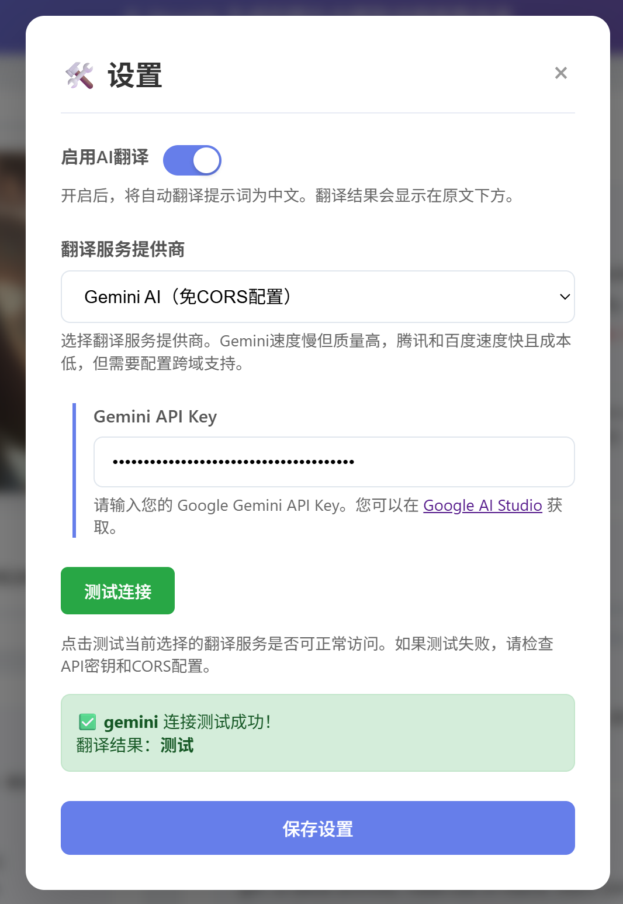

# NovelAI 图片解析器

一个专用于解析 NovelAI 生成图片中隐写信息的纯本地单文件工具，支持多种翻译引擎的提示词翻译功能。

## ✨ 特点

- **🔒 纯本地运行**：无需服务器，所有处理都在浏览器本地完成
- **📄 单文件设计**：仅需一个 HTML 文件，下载即用
- **🌐 多引擎翻译**：支持 Gemini AI、腾讯云翻译、百度翻译三种引擎
- **💡 实时高亮**：鼠标悬停提示词时高亮对应的翻译结果
- **🚀 本地缓存优化**：使用 36,000+ 条预翻译缓存，大幅降低API调用成本
- **🔧 智能翻译逻辑**：自动处理下划线转换、artist:前缀过滤等细节

## 🚀 使用方法

### 基本操作
1. 打开 `index.html` 文件
2. 将 NovelAI 生成的图片拖拽到加载区域
3. 工具会自动解析并显示提示词信息
4. 鼠标悬停在英文提示词或翻译结果上可**高亮**对应的两者（需启用翻译功能）

### 翻译功能配置
点击右上角⚙️设置按钮，选择翻译服务提供商并填入相应的API密钥。
API密钥等配置保存在本地，用于直接访问翻译服务接口，不会上传至其他云端。

## 🔧 翻译引擎对比

| 翻译引擎       | 优势                                           | 缺点                                       | 网络要求 |
| -------------- | ---------------------------------------------- | ------------------------------------------ | -------- |
| **Gemini AI**  | ✅ 翻译质量最高 ✅ 无需跨域配置 ✅ 配置简单 | ❌ 速度较慢 ❌ 需要科学上网 | 需要梯子 |
| **腾讯云翻译** | ✅ 免费额度高 | ❌ 翻译质量菜鸡 ❌ 需要跨域配置 | 国内直连 |
| **百度翻译**   | ✅ 速度快 ✅ 申请简单 | ❌ 翻译质量一般 ❌ 需要跨域配置 | 国内直连 |

## 📋 API 申请指南

<strong>🤖 Gemini AI 申请指南</strong>

### 📖 官方文档
- **API文档**：[Gemini API 文档](https://ai.google.dev/gemini-api/docs?hl=zh-cn)
- **收费详情**：[定价方案](https://ai.google.dev/pricing?hl=zh-cn)

### 💰 收费模式
- **免费方案**：在停用结算功能的Google Cloud项目中使用Gemini API完全免费（有每日免费额度限制）
- **付费方案**：已启用结算功能的项目按随用随付定价收费
- **查看方案**：申请完成后可在[API Key页面](https://aistudio.google.com/apikey)查看当前方案类型

### 🚀 申请步骤
1. **注册登录**：访问 [Google AI Studio](https://ai.google.dev/aistudio?hl=zh-cn) 并使用Google账户登录
2. **获取密钥**：前往 [API Key管理页面](https://aistudio.google.com/apikey) 点击"Create API Key"创建密钥
3. **保存密钥**：妥善保管生成的API Key

### ⚠️ 重要注意事项
- **需要科学上网**才能访问Google AI Studio和使用API
- 请妥善保管API密钥，泄露可能造成损失
- 免费方案有[使用量限制](https://ai.google.dev/gemini-api/docs/rate-limits?hl=zh-cn)，超出后需要等待恢复

### 🔧 本项目配置
1. 打开NovelAI图片解析器设置面板
2. 选择"Gemini AI"作为翻译服务提供商
3. 将API Key填入"Gemini API Key"输入框
4. 开启"启用AI翻译"开关
5. 点击"测试连接"验证配置
6. 保存设置

<strong>☁️ 腾讯云翻译申请指南</strong>

### 📖 官方文档
- **产品介绍**：[腾讯云机器翻译](https://cloud.tencent.com/product/tmt/getting-started)
- **收费详情**：[定价说明](https://cloud.tencent.com/product/tmt/pricing)

### 💰 收费模式
- **免费额度**：每月前500万字符免费
- **超出收费**：58元/100万字符
- **并发限制**：5次/秒

### 🚀 申请步骤

#### 1. 注册登录
访问 [腾讯云官网](https://cloud.tencent.com/) 注册并登录账户

#### 2. 个人认证（必需）
> ⚠️ **重要**：使用免费服务前必须完成认证，已认证用户可跳过

- 进入 [账号信息-认证管理](https://console.cloud.tencent.com/developer/auth)
- 点击"开始个人认证"
- 如实填写个人信息并提交

#### 3. 开通机器翻译服务
> 💡 **提示**：如果控制台已显示用量数据，说明已开通，可跳过

- 进入 [机器翻译控制台](https://console.cloud.tencent.com/tmt)
- 勾选"我已阅读并同意服务等级协议"
- 点击"开通付费版"完成开通

#### 4. 获取API密钥
提供两种方式，任选其一：

**方式一：主账号密钥（快捷）**
- 进入 [API密钥管理](https://console.cloud.tencent.com/cam/capi)
- 点击"新建密钥"（如已有可直接使用）
- 记录SecretId和SecretKey

**方式二：子用户密钥（安全）**
- 进入 [用户管理](https://console.cloud.tencent.com/cam) 点击"新建用户"
- 选择"自定义创建" → "可访问资源并接受消息"
- 用户名随意设置，勾选"编程访问"
- 搜索并勾选"QcloudTMTFullAccess"权限
- 完成创建后记录SecretId和SecretKey

### ⚠️ 重要注意事项
- **认证必需**：未完成个人认证无法使用免费额度
- **密钥安全**：请妥善保管密钥，避免泄露造成损失
- **权限最小化**：建议使用子用户密钥，仅授予翻译权限

### 🔧 本项目配置
1. 打开NovelAI图片解析器设置面板
2. 选择"腾讯云翻译（需CORS配置）"
3. 分别填入Secret ID和Secret Key
4. **配置跨域支持**（见下方CORS配置说明）
5. 点击"测试连接"验证配置
6. 保存设置

<strong>🔍 百度翻译申请指南</strong>

### 📖 官方文档
- **产品介绍**：[百度翻译开放平台](https://fanyi-api.baidu.com/product/11)
- **收费详情**：[计费说明](http://fanyi-api.baidu.com/product/112)

### 💰 收费模式
| 服务版本 | 免费额度 | 超出费用 | 并发限制 |
|---------|---------|----------|----------|
| **标准版（无认证）** | 每月5万字符 | 49元/100万字符 | 1次/秒 |
| **高级版（个人认证）** | 每月100万字符 | 49元/100万字符 | 10次/秒 |
| **尊享版（企业认证）** | 每月200万字符 | 49元/100万字符 | 100次/秒 |

### 🚀 申请步骤

#### 1. 注册登录
访问 [百度翻译开放平台](http://fanyi-api.baidu.com/api/trans/product/prodinfo) 注册并登录百度账户

#### 2. 注册开发者
- 登录后点击页面下方"立即使用"按钮
- 点击"开始注册"进入开发者注册流程
- **如实填写**个人信息（姓名、邮箱、手机等）
- 点击"下一步"完成基础注册

#### 3. 身份认证（可选）
- **标准版用户**：点击"暂不认证"，每月仅5万字符免费额度
- **高级版用户**：填写真实姓名和身份证号完成实名认证，获得更高免费额度
- 认证成功后点击"开通服务"

#### 4. 开通通用翻译API
- 注册完成后自动跳转，或访问 [服务开通页面](http://fanyi-api.baidu.com/api/trans/product/apichoose)
- 选中"通用翻译API"点击"下一步"
- 再次选择是否进行身份认证（影响免费额度）
- 填写应用名称（可随意填写），其他字段可留空
- 勾选"我已知晓翻译API计费规则"
- 点击"我已了解，确认开通"

#### 5. 获取密钥
> ⚠️ **重要**：必须完成前面所有步骤，否则获取的密钥无法使用

访问 [密钥查询页面](http://fanyi-api.baidu.com/api/trans/product/desktop?req=developer) 获取：
- **APP ID**：应用的唯一标识
- **密钥**：应用的访问密钥

### ⚠️ 重要注意事项
- **完整流程**：跳过任何步骤都可能导致API无法使用
- **网络限制**：同一网络下多个不同百度账号使用可能被临时封禁（错误码58003）
- **封禁恢复**：如遇封禁请第二天重试
- **密钥安全**：请妥善保管密钥，避免泄露

### 🔧 本项目配置
1. 打开NovelAI图片解析器设置面板
2. 选择"百度翻译（需CORS配置）"
3. 分别填入APP ID和密钥
4. **配置跨域支持**（见下方CORS配置说明）
5. 点击"测试连接"验证配置
6. 保存设置

## 🌐 跨域配置方法

腾讯云翻译和百度翻译需要解决浏览器跨域限制问题，请选择以下任一方案：

### 方案A：浏览器插件（推荐）

安装 [Cross Domain - CORS](https://chromewebstore.google.com/detail/cross-domain-cors/mjhpgnbimicffchbodmgfnemoghjakai) 插件：

1. 安装并启用插件
2. 点击插件图标打开设置
3. 删除默认的通配符 `*`
4. 仅添加以下域名：
   - `tmt.tencentcloudapi.com`（腾讯云翻译）
   - `fanyi-api.baidu.com`（百度翻译）
5. 确认上面的按钮是 **绿色Enable** 状态后刷新页面

### 方案B：油猴脚本

如果您已安装 Tampermonkey，可以安装 [NovelAI 翻译工具 CORS 支持](https://greasyfork.org/zh-CN/scripts/541542-novelai-%E7%BF%BB%E8%AF%91%E5%B7%A5%E5%85%B7-cors-%E6%94%AF%E6%8C%81) 脚本：

安装后会自动处理跨域问题，无需额外配置。

## 🔧 技术特性

- 纯前端实现，无需后端服务
- 支持现代浏览器的 Web Crypto API
- 响应式设计，支持移动端使用
- 轻量级，单文件设计
- 本地缓存系统，支持 36,000+ 条预翻译
- 智能翻译逻辑：
  - 自动将下划线转换为空格进行翻译查找
  - 过滤 `artist:` 前缀标签，保持原样不翻译
  - 支持权重语法高亮和解析

## 📝 注意事项

1. **网络需求**：
   - Gemini AI 需要科学上网
   - 腾讯云和百度翻译可国内直连
   
2. **跨域配置**：
   - Gemini AI 无需配置
   - 腾讯云和百度翻译必须配置跨域支持
   
3. **API 限制**：
   - 使用自己申请的API Key，注意避免超出免费额度
   - 可以配置多个翻译服务作为备用

## 🚨 常见问题

**Q: 为什么翻译功能不工作？**  
A: 检查API密钥是否正确，网络连接是否正常，如使用腾讯云或百度翻译请确保已配置跨域支持。

**Q: 支持哪些图片格式？**  
A: 主要支持PNG格式的NovelAI生成图片，部分JPEG格式也支持。

**Q: 如何减少翻译API调用成本？**  
A: 
- 工具已内置36,000+条预翻译缓存，常用标签无需API调用
- 推荐配置多个翻译服务，充分利用各家免费额度

**Q: artist:标签为什么不翻译？**  
A: 这是有意设计的，`artist:ningen mame` 等艺术家标签应保持原样，翻译后会失去特定含义。

## 📄 许可证

本项目为开源项目，请合理使用。使用第三方翻译服务时请遵守相应的服务条款。

---

**💡 提示**：建议同时配置多个翻译引擎，当主引擎不可用时会自动切换到备用引擎，确保翻译功能持续可用。